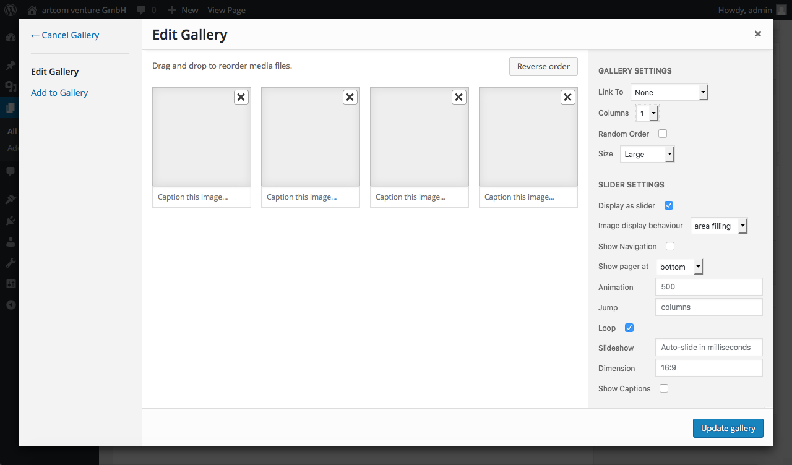
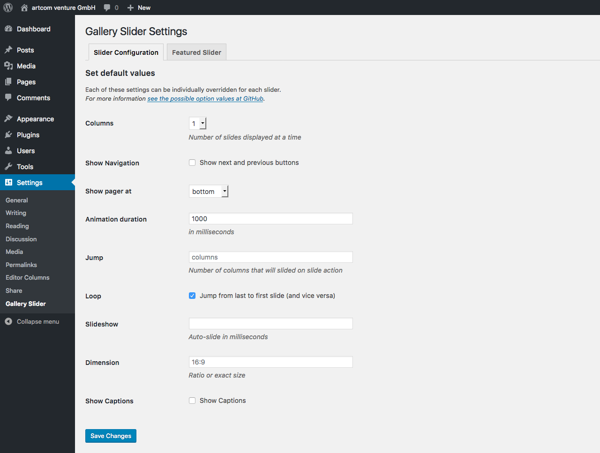
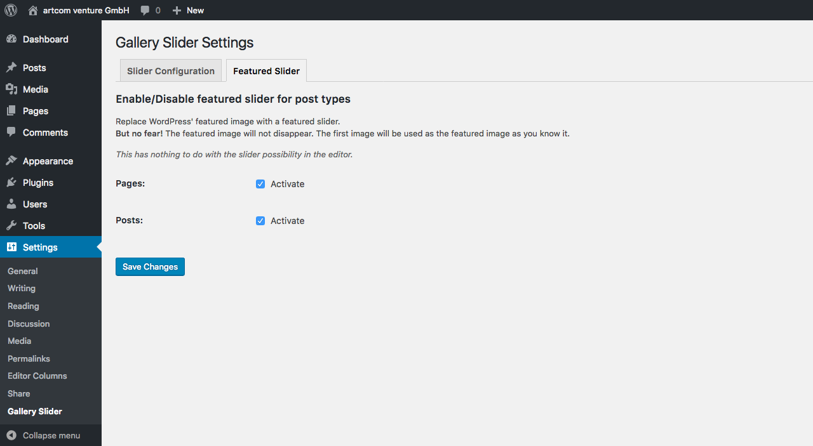

# WordPress Gallery Slider

Extends the WordPress gallery section in the media popup with slider options.

[See some DEMOS on our website](https://www.artcom-venture.de/?p=1272)


## Installation

1. Upload files to the `/wp-content/plugins/` directory of your WordPress installation.
  * Either [download the latest files](https://github.com/artcomventure/wordpress-plugin-slider/archive/master.zip) and extract zip (optionally rename folder)
  * ... or clone repository:
  ```
  $ cd /PATH/TO/WORDPRESS/wp-content/plugins/
  $ git clone https://github.com/artcomventure/wordpress-plugin-slider.git
  ```
  If you want a different folder name than `wordpress-plugin-slider` extend clone command by ` 'FOLDERNAME'` (replace the word `'FOLDERNAME'` by your chosen one):
  ```
  $ git clone https://github.com/artcomventure/wordpress-plugin-slider.git 'FOLDERNAME'
  ```
2. Activate the plugin through the 'Plugins' screen in WordPress.
3. **Enjoy**

## Usage

1. Go to the post and select in the editor the position you want to insert a slider.
2. Click on 'Add media' right above the editor.
3. Switch to 'Create Gallery', choose the images you want to display and click the 'Create a new gallery' button in the lower right corner.
4. Activate slider by checking 'Display as slider'.
5. Configure slider (and images) to fit your needs.



To change an existing slider click on the slider (gallery), click on the _edit pencil_ and repeat #5.

### Default configuration

Since version `1.9.0` you can set the default configuration for all sliders in the WordPress backend and override the js defaults (see **[Possible options](#possible-options)**).



## Featured Slider

With version `1.10.0` comes a new _optional*_ feature within this plugin: The Featured Slider.

This is similar to WordPress' Featured Image but extends it with the possibility to select multiple images.

But no fear! The featured image will not disappear. The first image of the selected images will be used as the featured image _as you know it_.

_* If you want to use it define the post types you want to use it for. If you don't ... just keep it as it is ;)_



On single posts/pages the featured slider is automatically displayed by calling WordPress' `the_thumbnail_html()`. So you don't need to change your templates at all.

If you want to use it somewhere else, here is how it's done:

```php
<?php // display the featured slider html
the_featured_slider(); // or:
echo get_the_featured_slider(); ?>
```

## Use slider js standalone

**Markup example.** You don't necessarily use an `ul`. It also could be interleaved `div`s. But it must be 3 levels to the _content_.
For _pure_ image sliders<sup>1</sup> it's mandatory to add the class `gallery`.

```html
<div id="my-slider" class="gallery" data-OPTION="VALUE">
    <ul>
        <li>
            
            <div class="slider__caption" />
        </li>
        <li>
            
            <div class="slider__caption" />
        </li>
        <li>
            
            <div class="slider__caption" />
        </li>
        <!-- ... and so on -->
    </ul>
</div>
```

Initial call to HTMLElement, HTMLCollection, NodeList or CSS selector (e.g. `'#my-slider'`)

```javascript
var mySlider = new Slider( ELEMENT, OPTIONS );
```

### Possible options

These options could be passed via HTML `data-`attributes or set as `object` on the js call.

|Option|Type|Value|Default<sup>1</sup>|
|------|----|-----|-------|
|startSlide|integer|Slide to begin with.|1|
|duration|integer|Slide animation duration im ms.|500|
|loop|boolean|Loop from end to start and the other way round.|true|
|pager|string or boolean|Position of the pager. Possible values: 'top', 'bottom' or 'none' (to hide pager).|bottom|
|navigation|boolean|Show/hide next and previous buttons.|false|
|dimension|string|Dimension of the slider. Could be 'auto'<sup>2</sup>, a ratio (e.g. '16:9') or an exact size (e.g. '600px x 400px').|16:9|
|columns|integer|Number of slides to show at once.|1|
|jump|string or integer|Number of slides to scroll on a slide action. Integers should be between 1 and the value of the _columns_ option (see above), otherwise it's calculated to its min./max. possible value. |'columns' (_dynamic_ option value of the _columns_ option (see above))|
|slideshow|integer or boolean|Delay of auto slide in ms.|false|
|size<sup>`1.11.0`</sup>|string|Image size behaviour. Possible values: '[cover](https://developer.mozilla.org/en/docs/Web/CSS/background-size?v=control#cover)' or '[contain](https://developer.mozilla.org/en/docs/Web/CSS/background-size?v=control#contain)'|'cover'|

<sup>2</sup> The display of image sliders with dimension 'auto' and size 'cover' is buggy ... and thus disabled for now. Instead it uses size 'contain' internally. :/

### Additional js options

|Option|Type|Value|Default<sup>1</sup>|
|------|----|-----|-------|
|onInit|function|Callback after slider is initialized.|`function() {}`|
|onBeforeSlide|function|Callback before slide begins.|`function() {}`|
|onAfterSlide|function|Callback on slide's completed.|`function() {}`|

### <sup>1</sup> Override default values

```javascript
// add an array object named 'SliderDefaults' with all your desired default settings
// BEFORE the slider js file is included
SliderDefaults = {
    ATTRIBUTE: VALUE,
    ATTRIBUTE: VALUE,
    ...
};

// if you want to change them after init
// simply call:
// !!! this has no effect on already attached sliders
Sliders.setDefaults({
    ATTRIBUTE: VALUE,
    ATTRIBUTE: VALUE,
    ...
});
```

## Interaction

Programmatically trigger slide:

```javascript
// go to next slide
mySlider.slider( 'next' );

// back to previous slide
mySlider.slider( 'prev' );

// slide to slide number 3
mySlider.slider( 3 );
```

Get values:

```javascript
// get current value
mySlider.slider( 'get', OPTION );

// get initial value
mySlider.slider( 'get', OPTION, true );
```

Change options on the fly:

```javascript
// OPTION: duration, loop, pager, navigation, dimension, columns, jump, captions or slideshow
document.getElementById( 'my-slider' ).slider( 'set', OPTION, VALUE );

// ... or for multiple options at once:
document.getElementById( 'my-slider' ).slider( 'set', {
    OPTION: VALUE,
    OPTION: VALUE
} );
```

Remove slider and its traces from element:

```javascript
mySlider.slider( 'destroy', 'destroy' );
```

## Plugin Updates

Although the plugin is not _yet_ listed on https://wordpress.org/plugins/, you can use WordPress' update functionality to keep it in sync with the files from [GitHub](https://github.com/artcomventure/wordpress-plugin-slider).

**Please use for this our [WordPress Repository Updater](https://github.com/artcomventure/wordpress-plugin-repoUpdater)** with the settings:

* Repository URL: https://github.com/artcomventure/wordpress-plugin-repoUpdater/
* Subfolder (optionally, if you don't want/need the development files in your environment): build

_We test our plugin through its paces, but we advise you to take all safety precautions before the update. Just in case of the unexpected._

## Questions, concerns, needs, suggestions?

Don't hesitate! [Issues](https://github.com/artcomventure/wordpress-plugin-slider/issues) welcome.
